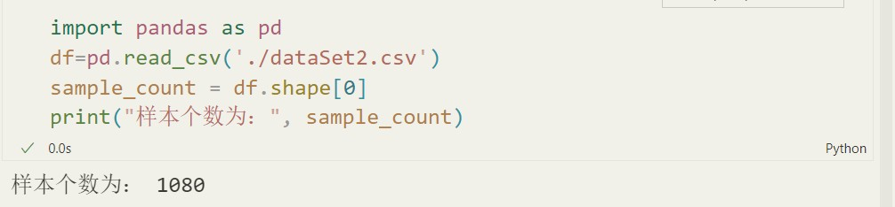
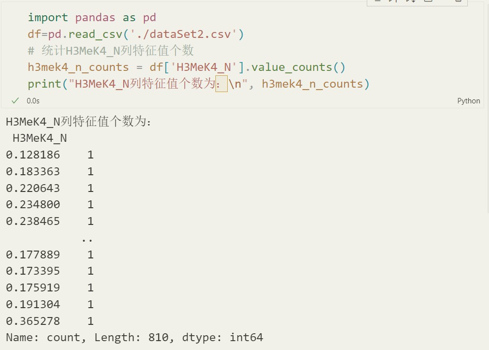
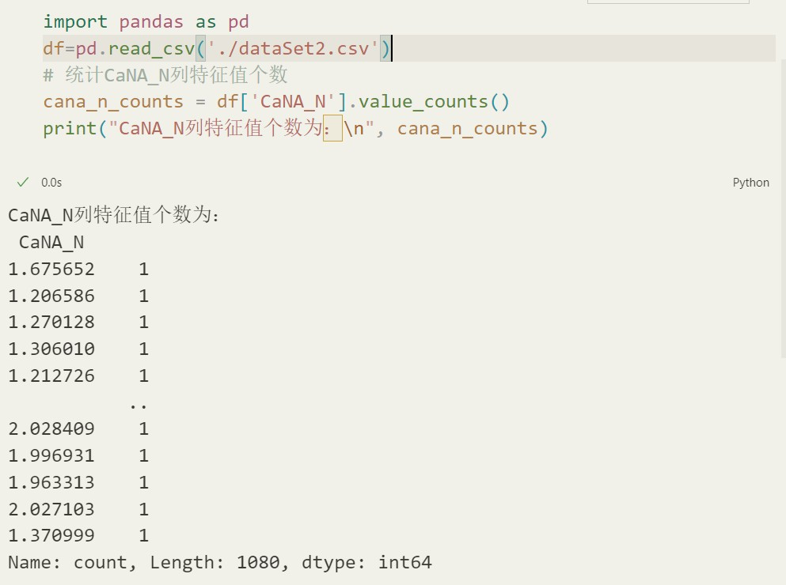
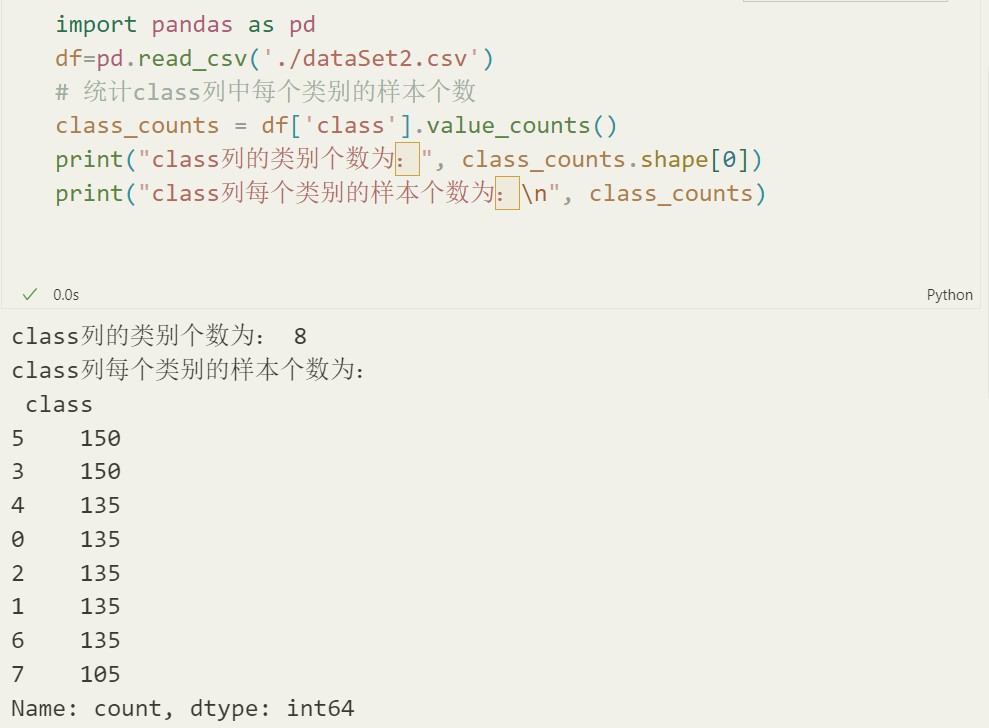
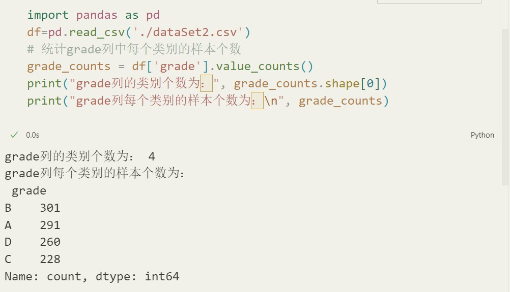
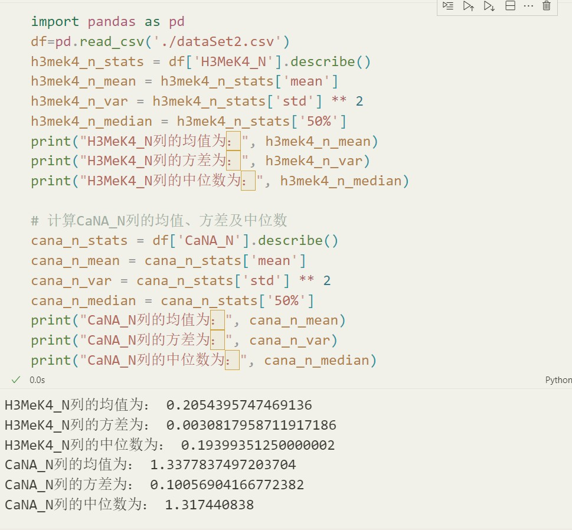

# 实验报告一

## 任务一
- 统计数据集中的样本个数
- 
- 统计`H3MeK4_N`列的特征值的个数
- 
- 统计`CaNA_N`列的特征值的个数
- 
- 统计`class`列的类别个数与每个类别的样本个数
- 
- 统计`grade`列的类别个数与每个类别的样本个数
- 
- 计算`H3MeK4_N`列、`CaNA_N`列的均值、方差及中位数
- 

## 任务四
- 采用的数据集是`113120200176_data4_mode.csv `
